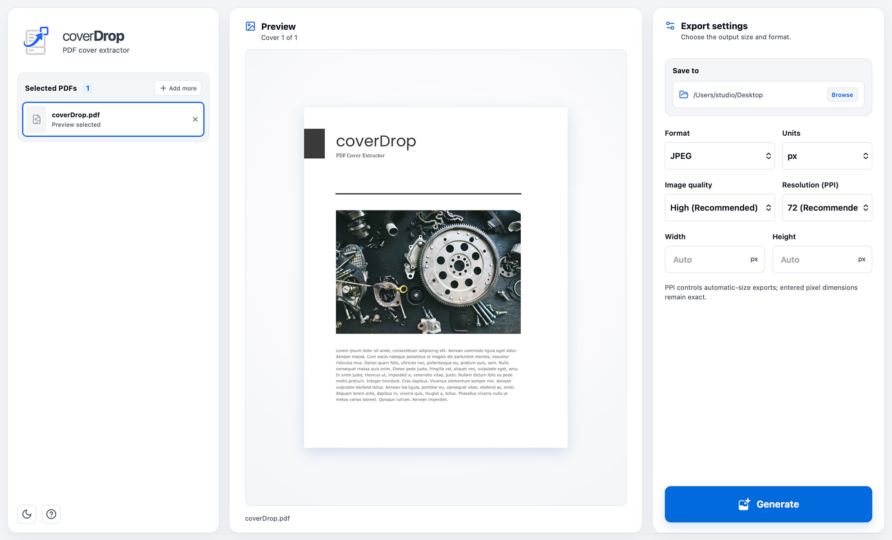

# CoverDrop for macOS

CoverDrop is a privacy-friendly macOS desktop app that turns the first page of any PDF into a website-ready cover image, right on your Mac.

[](downloads/CoverDrop_macOS_1.0.0.dmg)



## Download

[Download CoverDrop 1.0.0 for Apple Silicon macOS](downloads/CoverDrop_macOS_1.0.0.dmg), or view the [GitHub release](https://github.com/taidev/CoverDrop-macOS/releases/tag/v1.0.0) for release details.

This build is ad-hoc signed but not Apple-notarized. On first launch, macOS may require you to Control-click the app and choose **Open**.

## Features

- Choose individual PDF files or process folders recursively.
- Preview first pages before export.
- Export JPEG, PNG, lossless WebP, or GIF.
- Resize with pixels or physical units.
- Fit or crop to exact dimensions with nine anchor positions.
- Preserve input subfolders and safely number duplicate filenames.
- Process files locally without intentionally uploading PDF contents.
- Use light and dark themes.

## Supported platform

This repository is for Apple Silicon Macs. Intel Macs are not currently supported. The Windows edition is maintained separately in [CoverDrop-Windows](https://github.com/taidev/CoverDrop-Windows). Release packaging requires a complete, native Poppler renderer bundle. Standalone renderer binaries are deliberately not committed to this source repository.

## Development

Install Node.js, Rust, and Poppler so that `pdftoppm` is available on your command line.

```sh
npm ci
npm run tauri dev
```

Run the checks with:

```sh
npm run build
cargo test --manifest-path src-tauri/Cargo.toml
```

## Production packaging

CoverDrop ships Poppler as a platform-specific renderer. Release builds refuse to continue when the matching renderer is missing, preventing an installer that cannot generate covers.

Expected macOS renderer locations:

- Apple Silicon macOS: `src-tauri/binaries/macos-aarch64/pdftoppm`
- Intel macOS: `src-tauri/binaries/macos-x86_64/pdftoppm`

Build an Apple Silicon macOS disk image with:

```sh
npm run tauri build -- --bundles dmg
```

Public macOS releases should be signed and notarized with an Apple Developer ID. Before distributing an installer, document and satisfy the source and notice obligations for Poppler and every library in the renderer bundle; see [THIRD_PARTY_NOTICES.md](THIRD_PARTY_NOTICES.md).

## Privacy

CoverDrop operates on local files. It does not intentionally transmit PDF contents or generated images over the network. Source PDFs are never modified.

## Contributing

Contributions are welcome. Read [CONTRIBUTING.md](CONTRIBUTING.md) before opening a pull request. Report security concerns according to [SECURITY.md](SECURITY.md).

## License

CoverDrop is free software licensed under the [GNU General Public License v3.0 or later](LICENSE).

Copyright © 2026 TaiDev.
